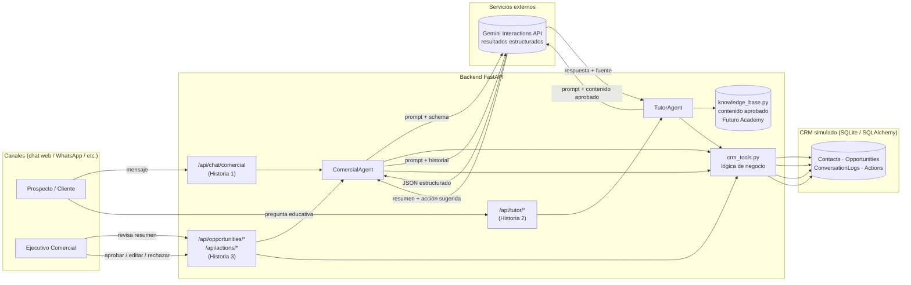

# Backend — Track 1: Inteligencia Conversacional para Ventas y Gestión de Clientes (CRM)

Backend completo para el **Agente Comercial IA (CRM y Chat)** y el **Tutor IA de Futuro Academy**,
construido según la *Guía de Desarrollo — Hackathon de Agentes Financieros IA (Track 1)* y usando la
**Interactions API de Gemini** (`google-genai`) según la guía *"Cómo empezar" de Google AI for Developers*.

## 1. Track asignado

**Track 1 — Inteligencia Conversacional para Ventas y Gestión de Clientes (CRM)**, que implementa las
3 historias de usuario mínimas de la guía:

| Historia | Endpoint principal | Descripción |
|---|---|---|
| 1. Calificación conversacional de leads | `POST /api/chat/comercial` | Identifica B2B/B2C, hace preguntas de calificación, calcula prioridad y crea/actualiza el contacto y la oportunidad en el CRM. |
| 2. Tutor financiero (Futuro Academy) | `POST /api/tutor/ask`, `GET /api/tutor/quiz/{topic}`, `POST /api/tutor/consent` | Responde solo con contenido aprobado (citando la fuente), ofrece un quiz de 3 preguntas y registra el interés como señal comercial, con consentimiento. |
| 3. Seguimiento y derivación comercial | `GET /api/opportunities/{id}/summary`, `POST /api/actions/{id}/decision` | Resume necesidad/perfil/objeciones/etapa, propone una acción y espera aprobación humana antes de "enviarse". |

## 2. Tipo de negocio al que aplica

Empresas de **servicios financieros con fuerza de ventas y contenido educativo** (ej. gestoras de
fondos, fintechs de inversión, academias financieras asociadas a un banco o correduría). Sirve tanto
para **B2B** (asesoría a empresas, tesorería, planes corporativos) como **B2C** (personas naturales que
quieren empezar a invertir), unificando el embudo comercial y la educación financiera en un mismo CRM.

## 3. Diagrama de arquitectura



**Principios de diseño:**

- **Lógica separada de la interfaz**: los endpoints (`app/routers/`) solo traducen HTTP ↔ agentes;
  la lógica de negocio (scoring, persistencia, reglas de consentimiento) vive en `app/tools/crm_tools.py`,
  reutilizable y testeable sin necesidad del LLM.
- **Anti-alucinación**: el Tutor IA solo responde con contenido de `knowledge_base.py` y siempre cita
  la fuente; si el tema no está aprobado, lo dice explícitamente. El Agente Comercial usa **resultados
  estructurados** (`response_format` con JSON Schema/Pydantic) en vez de texto libre, para que el CRM
  reciba siempre campos válidos y verificables.
- **Continuidad de la conversación**: cada sesión de chat se asocia a un `Contact` y su historial se
  guarda en `ConversationLog`, que se reinyecta como contexto en cada llamada al modelo.
- **Acciones sensibles como propuesta**: ninguna comunicación se envía automáticamente. La Historia 3
  crea una `Action` en estado `pendiente` que un ejecutivo humano debe aprobar, editar o rechazar
  (`POST /api/actions/{id}/decision`).

## 4. Cómo se integraría a un sistema empresarial existente

- **CRM real**: `app/tools/crm_tools.py` es la única capa que toca la base de datos. Para conectarse a
  un CRM real (Salesforce, HubSpot, etc.) basta con reemplazar las funciones de este módulo por
  llamadas a la API del CRM correspondiente, sin tocar los agentes ni los routers.
- **Canales**: los routers son agnósticos al canal; se puede exponer el mismo `POST /api/chat/comercial`
  detrás de un conector de WhatsApp Business API, un widget web o un bot de Slack/Teams para ventas B2B.
- **Autenticación empresarial**: agregar un middleware de FastAPI (OAuth2/JWT contra el IdP corporativo)
  delante de los routers; el diseño actual ya aísla la sesión (`session_id`) del contacto para soportar
  múltiples canales autenticados.
- **Auditoría y cumplimiento**: la tabla `Action` funciona como bitácora de aprobación humana,
  requerida para acciones reguladas en el sector financiero (ver regla de la guía: *"las acciones
  reguladas o sensibles deben quedar como propuesta, alerta o solicitud de aprobación"*).
- **Escalado**: cambiar `DATABASE_URL` a Postgres/MySQL administrado y desplegar la imagen Docker
  (incluida) detrás de un balanceador; el modelo de Gemini se configura por variable de entorno
  (`GEMINI_MODEL`), sin cambios de código.

## 5. Uso de la API de Gemini (Interactions API)

Se usa `google-genai` siguiendo el patrón de la documentación oficial:

- `client.interactions.create(model=..., input=..., response_format={...})` para **resultados
  estructurados** (calificación de leads, resumen de oportunidad, quiz) — ver `app/gemini_client.py`.
- `previous_interaction_id` para conversaciones con estado (no implementado end-to-end en esta versión
  del backend por simplicidad del demo, pero el wrapper ya soporta el parámetro).
- Bucle de **function calling** (`run_with_tools`) disponible en `app/gemini_client.py` para escenarios
  donde se prefiera que el propio modelo invoque herramientas del CRM directamente.

**Mención para el premio "Best Use of Google Gemini"**: este proyecto usa la Interactions API de
Gemini como motor de todos los agentes (calificación de leads, tutor financiero con contenido
aprobado y citas de fuente, y generación de resúmenes/acciones estructuradas).

## 6. Cómo correr el proyecto

```bash
# 1. Instalar dependencias
pip install -r requirements.txt

# 2. Configurar variables de entorno
cp .env.example .env
# editar .env y colocar tu GEMINI_API_KEY (https://aistudio.google.com/api-keys)

# 3. Levantar el servidor
uvicorn app.main:app --reload

# Docs interactivas: http://localhost:8000/docs
```

### Con Docker

```bash
docker build -t agentes-financieros-backend .
docker run -p 8000:8000 --env-file .env agentes-financieros-backend
```

## 7. Tests

```bash
pytest tests/ -v
```

- `tests/test_lead_scoring.py` — **nivel intermedio**: tests unitarios de la función crítica de
  cálculo de prioridad (sin BD ni LLM).
- `tests/test_crm_tools.py` — tests de las funciones del CRM simulado usando una base SQLite en
  memoria (creación/actualización de contactos, consentimiento, flujo de aprobación de acciones).
- `tests/test_agent.py` — **`test_agent.py`** con mocks de la API del LLM (`FakeGeminiClient`) que
  confirman que ambos agentes responden algo coherente, sin depender de tener `GEMINI_API_KEY` ni de
  la disponibilidad del servicio de Gemini.

Los 15 tests corren en menos de un segundo y no requieren credenciales ni conexión a internet.

## 8. Endpoints principales

| Método | Ruta | Historia |
|---|---|---|
| POST | `/api/chat/comercial` | 1 |
| POST | `/api/tutor/ask` | 2 |
| GET  | `/api/tutor/quiz/{topic}` | 2 |
| POST | `/api/tutor/consent` | 2 |
| GET  | `/api/opportunities/{opportunity_id}/summary` | 3 |
| GET  | `/api/opportunities/{opportunity_id}/actions` | 3 |
| POST | `/api/actions/{action_id}/decision` | 3 |
| GET  | `/api/crm/contacts`, `/api/crm/contacts/{id}`, `/api/crm/opportunities` | Consulta CRM (demo) |
| GET  | `/health` | Salud del servicio |

## 9. Alcance y datos ficticios

Siguiendo la regla de alcance de la guía, este backend cumple el mínimo requerido del Track 1 con un
**CRM simulado** (SQLite) y una **base de conocimiento aprobada simulada** para Futuro Academy. Ambas
piezas están aisladas detrás de una capa de herramientas (`crm_tools.py`, `knowledge_base.py`) para
poder reemplazarse por integraciones reales sin modificar los agentes.
